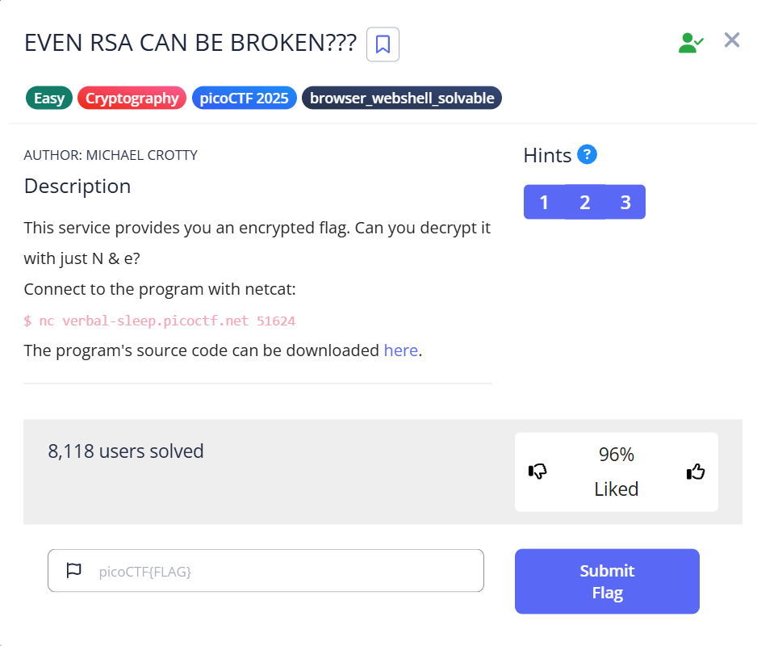

# EVEN RSA CAN BE BROKEN???

This is the write-up for the challenge **"EVEN RSA CAN BE BROKEN???"** from picoCTF 2025.

---

## 🧩 The Challenge


> This service provides you an encrypted flag. Can you decrypt it with just N & e?

You're provided with an RSA-encrypted flag. The only available information is the public key:
- `n` – the RSA modulus
- `e` – the public exponent (standard 65537)
- `c` – the ciphertext

You're asked to decrypt the flag without access to the private key.

---

## 🌐 How to Connect

You can connect to the service using `netcat`:

```bash
nc verbal-sleep.picoctf.net 51624
```

Once connected, the server provides the encrypted parameters:

```
n: 17963040052611794801647267168521201840636219788182790732010910483036610450705888626115067557862637819106351949645425600698588515079069679846950495617449518

e: 65537

cyphertext: 17285577301957659631568727827736898922150125779974300086107061241596116399457004114163371180128010310745116924525934794011802901006396533917230620162642755
```

---

## 🔍 Stage 1: Information Gathering

In this stage, we simply connect to the server and retrieve the raw values:

- **n** — the modulus  
- **e** — the public exponent (commonly 65537)  
- **c** — the ciphertext (encrypted flag)

These three values are all we need to **attempt** to break RSA — if the modulus `n` is weak.

In the next step, we’ll attempt to factor `n` into two primes `p` and `q`.

---

✔️ Once we have `n`, `e`, and `c`, we’re ready to move on to the next phase:  
**factoring `n`** to recover the private key `d`.

## 🔍 Stage 2.1: Factoring the Modulus

To break RSA, we first attempted to factor the public modulus `n`.

1. Visited [https://factordb.com](https://factordb.com).  
2. Pasted the provided modulus `n`.  
3. Clicked **Factor**.  
4. Retrieved only **one** prime factor:
   - `p = 898152002630589740082363358426060092031810989409139536600545524151830522535294431305753377893131890955317597482271280034
Since only `p` was available, we needed to compute the other prime factor `q` ourselves.

---

## 🔐 Stage 2.2: Computing `q`, Private Key and Decryption

With `p` known, we used Python to calculate `q`, compute the private exponent `d`, and decrypt the ciphertext:

```python
from Crypto.Util.number import inverse, long_to_bytes

# Known values
p = 898152002630589740082363358426060092031810989409139536600545524151830522535294431305753377893131890955317597482271280034
N = 17963040052611794801647267168521201840636219788182790732010910483036610450705888626115067557862637819106351949645425600698588515079069679846950495617449518
e = 65537
c = 17285577301957659631568727827736898922150125779974300086107061241596116399457004114163371180128010310745116924525934794011802901006396533917230620162642755

# Compute q
q = N // p

# Compute phi(N)
phi = (p - 1) * (q - 1)

# Compute private exponent d
d = inverse(e, phi)

# Decrypt ciphertext
m = pow(c, d, N)

# Convert to bytes
flag = long_to_bytes(m).decode()
print("Decrypted flag:", flag)

output:
Decrypted flag: picoCTF{tw0_1$_pr!m378257f39}

